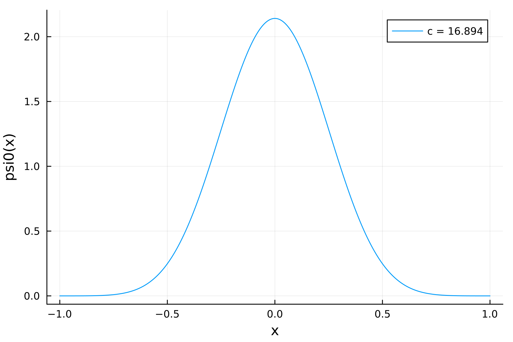

# Prolate Spheroidal Wave Function

[](https://github.com/ArrogantGao/PSWF/actions/workflows/ci.yml)

A C++ implementation of the prolate spheroidal wave function of the zeroth order (see the Chebfun documentation for more details [here](https://www.chebfun.org/examples/approx/Prolate.html), also the book by  Vladimir Rokhlin [here](https://link.springer.com/book/10.1007/978-1-4614-8259-8)).

## Python bindings

The project includes optional Python bindings powered by [pybind11](https://github.com/pybind/pybind11).
Enable them with CMake and build the `pypswf` module:

```bash
cmake -S . -B build -DBUILD_PYTHON=ON -DPYTHON_EXECUTABLE=/path/to/python
cmake --build build --target pypswf
```

You can then import the module from Python (ensure `build` is on your `PYTHONPATH`):

```python
import sys
sys.path.append("build")
import pypswf

value = pypswf.prolate0_eval(6.0, 0.5)
```

## Julia bindings

Enable them with CMake and build the `ProlateSpheroidal` module:

```bash
cmake . -B build
cmake --build build
```

You can add the module in Julia by
```julia
pkg> dev /path/to/project/julia
```

Then you can use it:
```julia
using ProlateSpheroidal
using Plots

c = prolc180(1e-6)
f = x -> prolate0_eval(c, x)

xs = range(-1, 1, length=10000)
plot(xs, f.(xs), dpi = 300, label = "c = $(c)", xlabel = "x", ylabel = "psi0(x)")

savefig("pswf.png")
```
You will get a figure like this:


